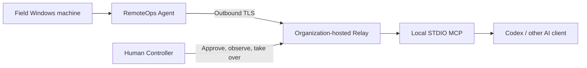

# RemoteOps

[中文 README](README.md)

RemoteOps is open-source, self-hosted remote operations software for field Windows diagnostics. A field user starts the Agent, which makes an outbound TLS connection to an organization-owned Relay. An engineer then uses Codex/MCP, the CLI, or the GUI from their own workstation to inspect the environment, run controlled commands, transfer files, and reach authorized serial or SSH devices.

It addresses a common field-support problem: installing an AI client, configuring SSH, or opening inbound ports on a customer machine is often impractical. RemoteOps lets AI assist with diagnostics inside explicit approval, audit, and local-permission boundaries. It is not a remote desktop or a general-purpose network tunnel.

## Current status

The current source version is `0.2.0-preview.1`, the candidate for the first GitHub Technical Preview. This source is intended for developer and pilot evaluation, not critical production use. GitHub Release artifacts still require the independent build and release gates described below.

- Protocol: `v12`
- Field endpoint: Windows x64 Agent
- Relay: self-hosted Linux x64 Docker
- AI entry point: local STDIO MCP (Model Context Protocol)
- License: [`AGPL-3.0-only`](LICENSE)

Core transport, permissions, environment discovery, MCP tools, bilingual GUI, and local serial regression are in place. Low-privilege Windows, Windows Service, real serial/switch hardware, code signing, and a native Agent GUI crash seen in some Windows 11 environments remain open validation items.

## How it works



- **Agent** runs on the field Windows machine. It only connects outbound to the Relay, shows a temporary pairing code, reports sanitized environment information, and executes actions within the local permission selected on site.
- **Relay** runs in Linux Docker under the organization’s control. It handles TLS, pairing, session forwarding, leases, and approval-state/policy checks. The deployment organization hosts the Relay; RemoteOps does not provide a shared public Relay.
- **MCP** runs locally on the engineer’s workstation and exposes structured diagnostic tools to Codex or another MCP client.
- **Control mode** defaults to per-action confirmation in the local MCP. A user may grant full control to one Agent session; the in-memory grant expires after one hour of inactivity. The separate Human Controller remains available for future takeover and multi-user workflows.

## Use cases

- Remote Windows troubleshooting: inspect the environment, shells, processes, services, networking, and logs, then run bounded read-only commands.
- Peripheral and driver support: collect evidence while investigating USB, driver, and service problems.
- Network-device maintenance: use authorized serial or SSH sessions through the same permission and audit boundary.
- Human-in-the-loop AI operations: let AI observe and analyze while a human approves sensitive actions and can stop the task.

## What it includes

- Windows Agent CLI, GUI, and a Windows Service still undergoing validation
- Self-hosted Linux Docker Relay with outbound-only Agent connectivity
- Controller CLI, Human Controller GUI, and Codex STDIO MCP
- Capability discovery for CMD, Windows PowerShell, PowerShell 7, and OpenSSH
- Structured shell, file, process, service, restart, bounded TCP, SSH, and serial operations
- CLI/MCP file transfers use 1 MiB chunks with a 16 GiB per-file limit; transfers above 1 GiB require a separate confirmation, and uploads plus local download overwrites use same-directory temporary files, SHA-256 verification, and recoverable atomic commits
- One-shot and persistent CMD, Windows PowerShell, and PowerShell 7 child processes run hidden on Windows; persistent shells support explicit `close_shell` and clean up correctly after `exit`
- `ReadOnly`, `ApprovalRequired`, `ControllerApproved`, and `FullAccess` protocol semantics; the Agent still enforces the final capability and operation boundary
- Human and AI cooperation within one session, with separate Owners rejected
- System trust roots, explicit CA PEM, and manually verified TLS fingerprints
- Chinese/English GUI, structured errors, timeouts, cancellation, events, and sanitized audit records

Serial and switch support has passed core and local regression testing; the formal remote path on real hardware remains a pilot-validation item. Relay recovery is limited to a valid Agent state/recovery token and the same MCP process. In-flight requests, approvals, and writes are never replayed automatically; after restarting MCP or Codex, pair the target again.

## Scope boundary

The preview does not include:

- Screen capture, video encoding, mouse/keyboard control, or multi-monitor support
- WebRTC, RDP/VNC gateways, SOCKS, arbitrary port forwarding, reverse tunnels, or network scanning
- macOS/Linux field endpoints
- A shared public Relay, proxy pool, or multi-tenant SaaS control plane
- Unattended general-purpose remote control, bastion-host, endpoint-protection, or asset-management features

If graphical control becomes necessary, RemoteOps will prefer an independent Visual Provider or an existing graphical MCP instead of reimplementing video codecs, remote-desktop protocols, or UI-automation engines. See [`docs/VISUAL_PROVIDER_RESEARCH.md`](docs/VISUAL_PROVIDER_RESEARCH.md).

## Quick start

### 1. Deploy a self-hosted Relay

The Relay requires Linux Docker, an accessible TLS port, and a certificate whose SAN contains the actual DNS name or IP. Copy the template:

```bash
cp deploy/relay/.env.example deploy/relay/.env
```

Edit `deploy/relay/.env` and set `REMOTEOPS_TLS_SANS`, distinct high-entropy Human and AI Controller tokens, and one shared `REMOTEOPS_CONTROLLER_OWNER_ID`. Never commit these values. Start the Relay:

```bash
docker compose --env-file deploy/relay/.env -f deploy/relay/docker-compose.yml up -d --build
```

See [`docs/部署与三机验收手册.md`](docs/%E9%83%A8%E7%BD%B2%E4%B8%8E%E4%B8%89%E6%9C%BA%E9%AA%8C%E6%94%B6%E6%89%8B%E5%86%8C.md) for the complete deployment and acceptance procedure.

### 2. Start the field Agent

Extract the Windows x64 package and run `remoteops-agent-gui.exe` on the field machine. On first launch, enter only the Relay address; no enrollment code or deployment-wide Agent token is required. Public CA certificates use the Windows trust store with no certificate file. For an unknown self-signed certificate, the GUI displays its SHA-256 fingerprint before sending RemoteOps credentials and lets the field user continue once or save the pin after verifying it through a separate trusted channel. Private CA, CLI, and Service deployments can still preconfigure `ca_cert` or a verified `tls_fingerprint`.

The Agent window shows connection status, a temporary pairing code, local capabilities, and the current assistance permission. Use the pairing code only for pairing; do not put it in documentation, logs, screenshots, or repositories. `remoteops-agent.exe` is available for automation and troubleshooting.

### 3. Install the local MCP

Extract the Windows x64 MCP package and run:

```powershell
powershell.exe -NoProfile -ExecutionPolicy Bypass -File .\Install-RemoteOpsMcp.ps1 `
  -RelayAddress 'relay.example.com:7443' `
  -OwnerId '<controller-owner-uuid>'
```

The installer securely prompts for the AI Controller Token and stores the Token and Owner in the current Windows user environment. Use `-CaCert` or `-TlsFingerprint` for private trust; they are mutually exclusive. Fully restart Codex and confirm that `remoteops` is connected in `/mcp`.

### 4. Start with a read-only check

Pair the Agent using the temporary code shown in its window, then ask the MCP client to list connections and inspect the target using read-only commands. Always use the exact `session_id` returned by `list_connections`; do not guess a target by hostname or alias.

After pairing, MCP defaults to per-action confirmation. Writes, restarts, service control, and serial writes prompt the current user; a full-control grant is isolated by `session_id`, stored only in MCP memory, and expires after one idle hour.

If a GitHub Release is not yet available, build the package from source first. Do not treat local `artifacts` as a public download source.

## Build and verify

Use the Rust toolchain declared by the root `Cargo.toml` and prepare Docker, PowerShell, and a Windows x64 build environment.

```powershell
cargo fmt --all -- --check
cargo check --workspace --locked
cargo clippy --workspace --all-targets --locked -- -D warnings
cargo test --workspace --locked
.\scripts\Test-Documentation.ps1
```

Build release packages with:

```powershell
.\scripts\Build-Release.ps1
```

Packages contain the Windows Agent/Controller/MCP, the Linux x64 Relay, the MCP installer ZIP, the project and third-party license manifests, a machine-readable dependency inventory, and `SHA256SUMS.txt`. Rebuild from a clean commit or CI and re-check hashes before creating a GitHub Release. Windows artifacts are currently unsigned and may trigger SmartScreen warnings.

## Security at a glance

- The Agent connects outbound to the Relay and does not listen on a customer public port.
- `ControllerApproved` means the authenticated local MCP completed user confirmation; Relay and Agent still validate identity, session, capability, path, and structured operation boundaries.
- Non-read-only actions default to MCP user confirmation. The legacy one-time Human Controller approval path remains available in explicit compatibility mode.
- Every target operation is bound to an immutable `session_id`; hostnames and aliases are not target selectors.
- Tokens, Owner UUIDs, pairing codes, recovery tokens, private keys, and customer data must not enter source, documentation, logs, or packages.

See [`SECURITY.md`](SECURITY.md) and [`docs/安全模型.md`](docs/%E5%AE%89%E5%85%A8%E6%A8%A1%E5%9E%8B.md) for the full security boundary and vulnerability-reporting process.

## Documentation

- [`docs/PROJECT_STATUS.md`](docs/PROJECT_STATUS.md): public progress and release gates
- [`docs/ROADMAP.md`](docs/ROADMAP.md): current phase, future directions, and stop conditions
- [`docs/README.md`](docs/README.md): documentation index
- [`docs/RemoteOpsMCP使用手册.md`](docs/RemoteOpsMCP%E4%BD%BF%E7%94%A8%E6%89%8B%E5%86%8C.md): Codex MCP setup and troubleshooting
- [`CONTRIBUTING.md`](CONTRIBUTING.md): contribution guide
- [`SECURITY.md`](SECURITY.md): security boundary and vulnerability reporting

## License

RemoteOps is licensed under [`AGPL-3.0-only`](LICENSE). It remains self-hosted and provider-neutral; integrating a third-party Visual Provider requires an independent review of its licenses and commercial restrictions.

