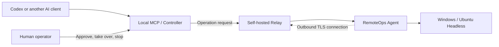

<div align="center">

# RemoteOps


**AI-assisted diagnostics for Windows and headless Linux, with explicit connection, permission, approval, and audit boundaries.**

[中文](README.md) · [English](README.en.md)

[](https://github.com/schneelolz/RemoteOps/actions/workflows/ci.yml)
[](https://github.com/schneelolz/RemoteOps/actions/workflows/security.yml)
[](CHANGELOG.md)
[](LICENSE)

</div>

## What it is

RemoteOps is a self-hosted tool for AI-assisted remote operations. A field Windows computer or headless Ubuntu host runs the Agent. An engineer runs a Controller or local MCP. Both connect through a Relay that you deploy and operate. AI can inspect the environment, run policy-controlled read-only diagnostics, inspect files and logs, and request human approval for changes.

The Agent makes an outbound connection to the Relay, so the field computer does not need a public inbound port. The AI client and its credentials stay on the engineer's computer.



The solid arrows show an operation request: Codex calls the local MCP, which sends it through the Relay to the Agent and the field computer. The dashed arrow shows connection setup: the Agent connects out to the Relay, so the field computer does not need a public inbound port.

## What it can do

- Inspect Windows and Ubuntu system, network, process, service, log, and capability information.
- Run one-shot or persistent shells with streaming UTF-8 output: CMD, Windows PowerShell, and PowerShell 7 on Windows; `/bin/sh` on Linux.
- Upload, download, and verify files inside a restricted transfer root.
- Connect to SSH and serial devices, with structured read-only queries and individually approved writes.
- Expose local STDIO MCP tools to Codex and other AI clients, with CLI and GUI controllers also available.
- Enforce Session, Owner, permission, human approval, TLS trust, and redacted audit boundaries.

It does not currently provide screen capture, mouse or keyboard control, RDP/VNC, arbitrary port forwarding, SOCKS, network scanning, a shared public Relay, macOS field agents, or Linux desktop control.

## Current support

| Component | Current scope | Status |
|---|---|---|
| Windows Agent | Windows x64 CLI/GUI and Windows Service | Core tests pass; native Windows build and runtime regression remain |
| Linux Agent | Ubuntu 24.04 x86_64 CLI / systemd | Native build, 50 isolated end-to-end checks, and service lifecycle pass |
| Relay | Linux x64 + Docker | Core and historical three-machine path pass |
| Controller/MCP | Windows x64 and Apple Silicon macOS | Mac MCP installation and Linux connection verified; native Windows CI remains |
| Device access | Windows, Linux, SSH, and serial | Local regression and Linux PTY serial tests pass; real hardware validation remains |

The Agent CLI / Service candidate is `0.2.0-preview.7`, the Agent GUI is `0.2.0-preview.9`, and SSH askpass is `0.2.0-preview.6`; Relay and MCP remain at `0.2.0-preview.5`. They share protocol `v14`. No public GitHub Release exists yet. It is intended for developers and controlled pilots, not critical production use. See [project status](docs/PROJECT_STATUS.md).

## Quick start

See the [documentation hub](docs/README.md) for complete parameters, certificates, backups, and troubleshooting.

### 1. Deploy your Relay

The Relay requires Linux x64, Docker, and an address reachable by both the Agent and the engineer's computer. Copy the template and set your tokens, Owner UUID, and TLS SANs:

```bash
cp deploy/relay/.env.example deploy/relay/.env
docker compose --env-file deploy/relay/.env -f deploy/relay/docker-compose.yml config --quiet
docker compose --env-file deploy/relay/.env -f deploy/relay/docker-compose.yml up -d --build
curl --fail http://127.0.0.1:18080/health
```

See [Relay deployment](docs/Relay部署说明.md). Never commit `.env`, tokens, private keys, or real pairing codes.

### 2. Start the field Agent

Run the Windows x64 Agent GUI or CLI and enter the Relay address. The Agent displays a temporary pairing code, connection state, and capability summary. Share the code only through a trusted channel.

For Ubuntu 24.04 x86_64, extract the Linux package and run:

```bash
sha256sum -c SHA256SUMS
cp agent-config.example.json agent-config.json
```

Edit `agent-config.json` to set your Relay address. Keep `ca_cert: null` for a public CA, or supply a readable certificate path for a private CA. Then install and inspect the connection:

```bash
sudo ./install-remoteops-agent.sh "$PWD/agent-config.json"
sudo ./status-remoteops-agent.sh
sudo ./status-remoteops-agent.sh --pairing
```

The service runs as a dedicated low-privilege user, starts at boot, restarts on failure, and logs to journald. Configuration lives at `/etc/remoteops/agent-config.json`; identity state and transfers live under `/var/lib/remoteops/`. Foreground debugging does not require sudo. See [Linux deployment](deploy/agent-service/linux/README.md) for CLI, upgrade, and uninstall instructions.

The initial Linux baseline is Ubuntu 24.04 x86_64, glibc, and systemd. Other distributions, ARM, and Linux desktop features are unverified.

### 3. Install local MCP

For installers, token storage, and uninstall steps, see [RemoteOps MCP guide](docs/RemoteOpsMCP使用手册.md) and [macOS MCP setup](docs/macOSMCP接入说明.md). Restart Codex and confirm that `remoteops` is connected in `/mcp`.

### 4. Start with read-only verification

```text
Pair the field computer with RemoteOps using the current code shown by the Agent window or Linux status script.
```

```text
List the remote connections and inspect the field computer's IPv4 address, default gateway, and DNS. Run read-only commands only.
```

Mutations require user approval in the default step-by-step mode. Full access requires explicit user authorization; additional checks such as large-transfer confirmation still follow tool policy. Application authorization does not grant Linux root privileges. Use the exact `session_id` returned by the connection list; do not infer a target from a hostname.

## Design and code structure

The project follows a “core libraries plus multiple shells” structure. Domain, policy, protocol, device, session, audit, and application use cases live in `crates`. GUI, CLI, MCP, Service, and Relay hosts live in `apps`. Shells own arguments, interaction, and host lifecycle; libraries own reusable rules. See the [architecture guide](docs/ARCHITECTURE.md), [code review](docs/CODE_REVIEW.md), and [contribution guide](CONTRIBUTING.md).

## Build and verify

Use a Rust toolchain meeting the root `Cargo.toml` rust-version. The Cargo checks below run locally; the documentation script requires PowerShell:

```powershell
cargo fmt --all -- --check
cargo check --workspace --locked
cargo clippy --workspace --all-targets --locked -- -D warnings
cargo test --workspace --locked
.\scripts\Test-Documentation.ps1
```

Build release assets with:

```powershell
.\scripts\Build-Release.ps1
```

Build the Linux Agent natively on Ubuntu 24.04 x86_64 with Rust, `build-essential`, `pkg-config`, `libudev-dev`, and Python 3:

```bash
bash scripts/Build-LinuxAgent.sh
cargo build --locked -p remoteops-relay -p remoteops-controller-mcp
python3 scripts/Test-LinuxAgentE2E.py --output artifacts/acceptance/linux-e2e.json
```

Run the end-to-end script as a regular user; it uses an isolated local Relay. Artifacts appear in `artifacts/release/0.2.0-preview.7/linux-x64/`: Agent and Service binaries, a systemd unit, install/uninstall/status scripts, sample configuration, third-party licenses, and SHA-256 manifests.

Recorded validation: 262 macOS workspace tests, Linux workspace checks, and 50 isolated Linux end-to-end checks pass. Native Windows regression and a full VM snapshot remain outstanding. See [Linux acceptance](docs/LinuxHeadless验收报告.md) for coverage and [release requirements](docs/发布与产物说明.md) for platform gates.

## Documentation

- [Documentation hub](docs/README.md)
- [Security model](docs/安全模型.md)
- [RemoteOps MCP guide](docs/RemoteOpsMCP使用手册.md)
- [Deployment and three-machine acceptance](docs/部署与三机验收手册.md)
- [Linux deployment](deploy/agent-service/linux/README.md) · [Linux acceptance](docs/LinuxHeadless验收报告.md)
- [Project status](docs/PROJECT_STATUS.md) · [Roadmap](docs/ROADMAP.md)
- [Contributing](CONTRIBUTING.md) · [Security reporting](SECURITY.md)

## License

RemoteOps is licensed under [AGPL-3.0-only](LICENSE). It remains self-hosted and vendor-neutral; check the license and commercial terms of any third-party AI or Visual Provider integration separately.
