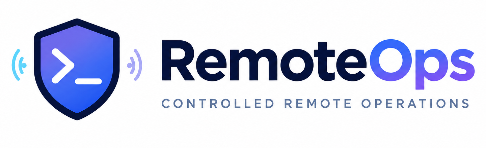
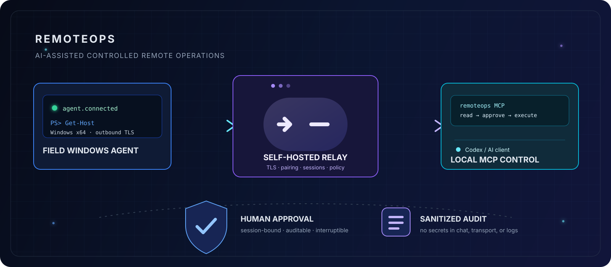
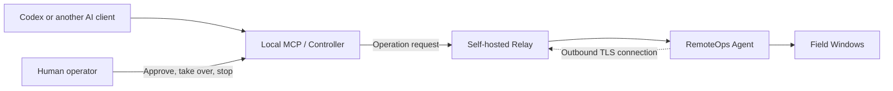

<div align="center">

# RemoteOps





**AI-assisted field diagnostics and controlled operations with explicit connection, permission, approval, and audit boundaries.**

[中文](README.md) · [English](README.en.md)

[](https://github.com/schneelolz/RemoteOps/actions/workflows/ci.yml)
[](https://github.com/schneelolz/RemoteOps/actions/workflows/security.yml)
[](CHANGELOG.md)
[](LICENSE)

</div>

## What it is

RemoteOps is a self-hosted tool for AI-assisted remote operations. A field Windows computer runs the Agent. An engineer runs a Controller or local MCP. Both connect through a Relay that you deploy and operate. AI can inspect the environment, run policy-controlled read-only diagnostics, inspect files and logs, and request human approval for changes.

The Agent makes an outbound connection to the Relay, so the field computer does not need a public inbound port. The AI client and its credentials stay on the engineer's computer.



The solid arrows show an operation request: Codex calls the local MCP, which sends it through the Relay to the Agent and the field computer. The dashed arrow shows connection setup: the Agent connects out to the Relay, so the field computer does not need a public inbound port.

## What it can do

- Inspect Windows system, network, process, service, log, and capability information.
- Run policy-controlled CMD, Windows PowerShell, and PowerShell 7 commands.
- Upload, download, and verify files inside a restricted transfer root.
- Connect to SSH and serial devices, with structured read-only queries and individually approved writes.
- Expose local STDIO MCP tools to Codex and other AI clients, with CLI and GUI controllers also available.
- Enforce Session, Owner, permission, human approval, TLS trust, and redacted audit boundaries.

It does not currently provide screen capture, mouse or keyboard control, RDP/VNC, arbitrary port forwarding, SOCKS, network scanning, a shared public Relay, or macOS/Linux field agents.

## Current support

| Component | Current scope | Status |
|---|---|---|
| Agent | Windows x64 CLI/GUI and Windows Service | Core tests pass; low-privilege and Service validation remain |
| Relay | Linux x64 + Docker | Core and historical three-machine path pass |
| Controller/MCP | Windows x64 and Apple Silicon macOS | Core tests pass; real Mac installation remains |
| Device access | Windows, SSH, and serial | Local regression passes; real hardware path remains |

The current source candidate is `0.2.0-preview.5` with protocol version `v14`. No public GitHub Release exists yet. It is intended for developers and controlled pilots, not critical production use. See [project status](docs/PROJECT_STATUS.md).

## Quick start

See the [documentation hub](docs/README.md) for complete parameters, certificates, backups, and troubleshooting.

### 1. Deploy your Relay

The Relay requires Linux x64, Docker, and an address reachable by both the Agent and the engineer's computer. Copy the template and set your tokens, Owner UUID, and TLS SANs:

```bash
cp deploy/relay/.env.example deploy/relay/.env
docker compose --env-file deploy/relay/.env -f deploy/relay/docker-compose.yml config --quiet
docker compose --env-file deploy/relay/.env -f deploy/relay/docker-compose.yml up -d --build
curl --fail http://127.0.0.1:18080/health
```

See [Relay deployment](docs/Relay部署说明.md). Never commit `.env`, tokens, private keys, or real pairing codes.

### 2. Start the field Agent

Run the Windows x64 Agent GUI or CLI and enter the Relay address. The Agent displays a temporary pairing code, connection state, and capability summary. Share the code only through a trusted channel.

### 3. Install local MCP

For installers, token storage, and uninstall steps, see [RemoteOps MCP guide](docs/RemoteOpsMCP使用手册.md) and [macOS MCP setup](docs/macOSMCP接入说明.md). Restart Codex and confirm that `remoteops` is connected in `/mcp`.

### 4. Start with read-only verification

```text
Pair the field computer with RemoteOps using the pairing code currently shown by the Agent.
```

```text
List the remote connections and inspect the field computer's IPv4 address, default gateway, and DNS. Run read-only commands only.
```

Writes, reboots, service control, serial writes, and large-file overwrites require confirmation. Use the exact `session_id` returned by the connection list; do not infer a target from a hostname.

## Design and code structure

The project follows a “core libraries plus multiple shells” structure. Domain, policy, protocol, device, session, audit, and application use cases live in `crates`. GUI, CLI, MCP, Service, and Relay hosts live in `apps`. Shells own arguments, interaction, and host lifecycle; libraries own reusable rules. See the [architecture guide](docs/ARCHITECTURE.md), [code review](docs/CODE_REVIEW.md), and [contribution guide](CONTRIBUTING.md).

## Build and verify

Use the Rust version declared by the root `Cargo.toml` and prepare Docker, PowerShell, or Apple Silicon tooling as required by the target:

```powershell
cargo fmt --all -- --check
cargo check --workspace --locked
cargo clippy --workspace --all-targets --locked -- -D warnings
cargo test --workspace --locked
.\scripts\Test-Documentation.ps1
```

Build release assets with:

```powershell
.\scripts\Build-Release.ps1
```

See [release and artifact requirements](docs/发布与产物说明.md) for Linux Relay, Windows Agent/MCP, and Apple Silicon MCP validation.

## Documentation

- [Documentation hub](docs/README.md)
- [Security model](docs/安全模型.md)
- [RemoteOps MCP guide](docs/RemoteOpsMCP使用手册.md)
- [Deployment and three-machine acceptance](docs/部署与三机验收手册.md)
- [Project status](docs/PROJECT_STATUS.md) · [Roadmap](docs/ROADMAP.md)
- [Contributing](CONTRIBUTING.md) · [Security reporting](SECURITY.md)

## License

RemoteOps is licensed under [AGPL-3.0-only](LICENSE). It remains self-hosted and vendor-neutral; check the license and commercial terms of any third-party AI or Visual Provider integration separately.
