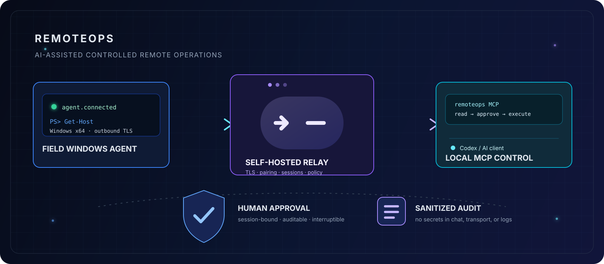
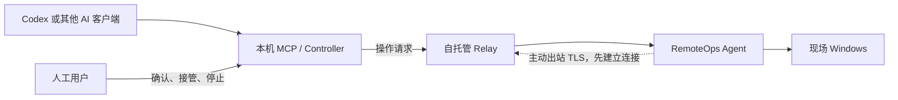

<div align="center">

# RemoteOps




**让 AI 协助诊断和处理现场 Windows，同时保留连接、权限、审批和审计边界。**

[中文](README.md) · [English](README.en.md)

[](https://github.com/schneelolz/RemoteOps/actions/workflows/ci.yml)
[](https://github.com/schneelolz/RemoteOps/actions/workflows/security.yml)
[](CHANGELOG.md)
[](LICENSE)

</div>

## 这是什么

RemoteOps 是一个自托管的 AI 辅助远程运维工具。现场 Windows 电脑运行 Agent，工程师本机运行 Controller 或本地 MCP，双方通过自己部署的 Relay 连接。AI 可以读取环境、执行受控的只读诊断、查看文件和日志，并在需要时提出由人工确认的修改操作。

Agent 只主动连接 Relay，现场不需要开放公网入站端口；AI 客户端和凭据也不需要安装在现场电脑上。



图中从左到右是一次操作请求的方向：Codex 通过本机 MCP 请求 Relay，再由 Agent 在现场执行。虚线表示网络连接的建立方向：Agent 主动连接 Relay，因此现场不需要开放公网入站端口。

## 能做什么

- 查看 Windows 系统、网络、进程、服务、日志和环境能力。
- 通过 CMD、Windows PowerShell、PowerShell 7 执行受策略约束的命令。
- 在受限目录内安全上传、下载和校验文件。
- 连接 SSH 设备和串口设备，支持结构化只读查询及逐项审批写入。
- 通过本地 STDIO MCP 接入 Codex 等 AI 客户端，也可使用 CLI 或 GUI。
- 使用 Session、Owner、权限模式、人工审批、TLS 信任和脱敏审计控制操作边界。

当前不包含屏幕采集、鼠标键盘控制、RDP/VNC、任意端口转发、SOCKS、网段扫描、共享公共 Relay 或 macOS/Linux 被控端。

## 当前支持范围

| 组件 | 当前范围 | 状态 |
|---|---|---|
| Agent | Windows x64 CLI/GUI，Windows Service | 核心测试通过；低权限和 Service 实机仍需验收 |
| Relay | Linux x64 + Docker | 核心和历史三机链路通过 |
| Controller/MCP | Windows x64、Apple Silicon macOS | 核心测试通过；Mac 实机安装仍需验收 |
| 设备能力 | Windows、SSH、串口 | 本地回归通过；真实硬件路径仍需复测 |

当前源码候选版本为 `0.2.0-preview.5`，协议版本为 `v14`，尚未创建公开 GitHub Release。它面向开发者和受控试点，不建议直接用于关键生产环境。发布状态和门禁见 [项目状态](docs/PROJECT_STATUS.md)。

## 快速开始

完整参数、证书、备份和排障步骤见 [文档中心](docs/README.md)。最短路径如下：

### 1. 部署自己的 Relay

Relay 需要 Linux x64、Docker 和一个 Agent 与工程师本机都能访问的地址。复制配置模板并填写 Token、Owner UUID 和 TLS SAN：

```bash
cp deploy/relay/.env.example deploy/relay/.env
docker compose --env-file deploy/relay/.env -f deploy/relay/docker-compose.yml config --quiet
docker compose --env-file deploy/relay/.env -f deploy/relay/docker-compose.yml up -d --build
curl --fail http://127.0.0.1:18080/health
```

详细说明：[Relay 部署说明](docs/Relay部署说明.md)。不要把 `.env`、Token、私钥或真实控制码提交到 Git。

### 2. 启动现场 Agent

在 Windows x64 现场电脑运行 Agent GUI 或 CLI，填入 Relay 地址。Agent 窗口会显示临时配对码、连接状态和能力摘要；配对码只通过可信渠道交给工程师。

### 3. 安装本机 MCP

Windows 和 Apple Silicon macOS 的安装器、Token 保存方式和卸载步骤见：[RemoteOps MCP 使用手册](docs/RemoteOpsMCP使用手册.md)、[macOS MCP 接入说明](docs/macOSMCP接入说明.md)。安装后重新启动 Codex，并确认 `/mcp` 中的 `remoteops` 已连接。

### 4. 先做只读验证

```text
使用 RemoteOps 配对现场客户机，控制码是 Agent 窗口当前显示的控制码。
```

```text
使用 RemoteOps 列出远程连接，并查看现场客户机的 IPv4 地址、默认网关和 DNS，只执行只读命令。
```

写入、重启、服务控制、串口写入和大文件覆盖必须经过当前用户确认；每次操作都使用准确的 `session_id`，不能根据主机名猜测目标。

## 设计与代码结构

项目按“核心类库 + 多种壳子”组织：领域、策略、协议、设备、会话、审计和应用用例位于 `crates`；GUI、CLI、MCP、Service 和 Relay 位于 `apps`。壳子负责参数、交互和宿主生命周期，核心类库负责可复用规则。架构边界见 [架构说明](docs/ARCHITECTURE.md)，审查结果和后续重构路径见 [代码审查报告](docs/CODE_REVIEW.md)。

## 构建与验证

要求 Rust 工具链满足根 `Cargo.toml` 的 `rust-version`，并按平台准备 Docker、PowerShell 或 Apple Silicon 环境：

```powershell
cargo fmt --all -- --check
cargo check --workspace --locked
cargo clippy --workspace --all-targets --locked -- -D warnings
cargo test --workspace --locked
.\scripts\Test-Documentation.ps1
```

构建发布资产：

```powershell
.\scripts\Build-Release.ps1
```

Linux Relay、Windows Agent/MCP 和 Apple Silicon MCP 的发布与验收要求见 [发布与产物说明](docs/发布与产物说明.md)。

## 文档入口

- [文档中心](docs/README.md)：按安装、使用、安全和维护分类的入口。
- [安全模型](docs/安全模型.md)：认证、权限、审批、TLS、审计和敏感信息边界。
- [RemoteOps MCP 使用手册](docs/RemoteOpsMCP使用手册.md)：MCP 工具与排障。
- [部署与三机验收手册](docs/部署与三机验收手册.md)：完整部署验证。
- [项目状态](docs/PROJECT_STATUS.md) · [路线图](docs/ROADMAP.md)：当前阶段和后续计划。
- [贡献指南](CONTRIBUTING.md) · [安全报告](SECURITY.md)。

## 许可证

RemoteOps 使用 [AGPL-3.0-only](LICENSE)。项目保持自托管和供应商中立；接入第三方 AI 或 Visual Provider 时，请单独核对其许可证和商用限制。
