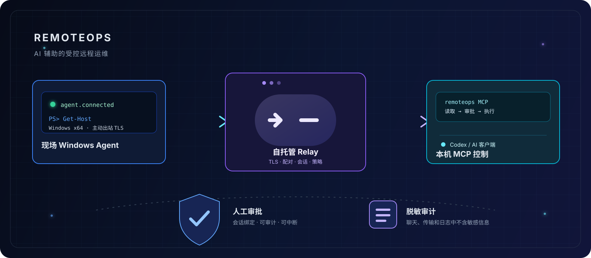
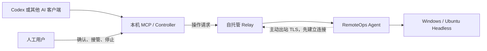

<div align="center">

# RemoteOps




**让 AI 协助诊断和处理 Windows 与 Linux 无界面主机，同时保留连接、权限、审批和审计边界。**

[中文](README.md) · [English](README.en.md)

[](https://github.com/schneelolz/RemoteOps/actions/workflows/ci.yml)
[](https://github.com/schneelolz/RemoteOps/actions/workflows/security.yml)
[](CHANGELOG.md)
[](LICENSE)

</div>

## 项目简介

RemoteOps 是一个自托管的 AI 辅助远程运维工具。受控 Windows 电脑或 Ubuntu 无界面主机运行 Agent，运维人员本机运行 Controller 或 MCP 服务，通过自托管 Relay 建立远程运维连接。AI 客户端可通过 MCP 查询系统环境、执行策略约束下的只读诊断、查看文件和日志，并为修改操作请求人工审批。

Agent 只主动连接 Relay，现场不需要开放公网入站端口；AI 客户端及其凭据保留在运维人员本机，无需配置到受控主机。



图中从左到右是一次操作请求的方向：Codex 通过本机 MCP 请求 Relay，再由 Agent 在现场执行。虚线表示网络连接的建立方向：Agent 主动连接 Relay，因此现场不需要开放公网入站端口。

## 核心功能

- 查看 Windows / Ubuntu Headless 系统、网络、进程、服务、日志和环境能力。
- 在 Windows 使用 CMD、Windows PowerShell、PowerShell 7，在 Linux 使用 `/bin/sh` 执行一次性或持久 Shell 命令，支持实时输出和 UTF-8。
- 在受限目录内上传、下载文件，并校验文件完整性。
- 连接 SSH 设备和串口设备，支持结构化只读查询及逐项审批写入。
- 通过本地 STDIO MCP 接入 Codex 等 AI 客户端，也可使用 CLI 或 GUI。
- 通过会话绑定（Session）、所有者隔离（Owner）、权限模式、人工审批、TLS 信任验证和脱敏审计约束远程操作。

当前不包含屏幕采集、鼠标键盘控制、RDP/VNC、任意端口转发、SOCKS、网段扫描、共享公共 Relay 或 macOS 被控端、Linux 桌面控制。

## 当前支持范围

| 组件 | 当前范围 | 状态 |
|---|---|---|
| Windows Agent | Windows x64 CLI/GUI，Windows Service | 核心测试通过；Windows 原生构建与实机回归仍需验证 |
| Linux Agent | Ubuntu 24.04 x86_64 CLI / systemd | 原生构建、50 项隔离全链路测试与服务生命周期验收通过 |
| Relay | Linux x64 + Docker | 核心和历史三机链路通过 |
| Controller/MCP | Windows x64、Apple Silicon macOS | Mac 本机 MCP 安装及 Linux 连接已验证；Windows 由原生 CI 验证 |
| 设备能力 | Windows、Linux、SSH、串口 | 本地回归与 Linux PTY 串口测试通过；真实硬件路径仍需复测 |

Agent CLI / Service 为 `0.2.0-preview.7`，Agent GUI 为 `0.2.0-preview.9`，SSH askpass 为 `0.2.0-preview.6`；Relay 与 MCP 仍为 `0.2.0-preview.5`，共用 `v14` 协议。尚未创建公开 GitHub Release。它面向开发者和受控试点，不建议直接用于关键生产环境。发布状态和验收要求见 [项目状态](docs/PROJECT_STATUS.md)。

## 快速开始

以下步骤概述 Relay 部署、Agent 接入和 MCP 配置流程。完整参数、证书配置、备份和排障步骤见 [文档中心](docs/README.md)。

### 1. 部署 Relay

Relay 需要 Linux x64、Docker 和一个 Agent 与工程师本机都能访问的地址。复制配置模板并填写 Token、Owner UUID 和 TLS SAN：

```bash
cp deploy/relay/.env.example deploy/relay/.env
docker compose --env-file deploy/relay/.env -f deploy/relay/docker-compose.yml config --quiet
docker compose --env-file deploy/relay/.env -f deploy/relay/docker-compose.yml up -d --build
curl --fail http://127.0.0.1:18080/health
```

详细说明：[Relay 部署说明](docs/Relay部署说明.md)。不要把 `.env`、Token、私钥或真实控制码提交到 Git。

### 2. 启动现场 Agent

在 Windows x64 现场电脑运行 Agent GUI 或 CLI，填入 Relay 地址。Agent 窗口会显示临时配对码、连接状态和能力摘要；配对码只通过可信渠道交给工程师。

Ubuntu 24.04 x86_64 主机使用 Linux 发布包。在解压目录执行：

```bash
sha256sum -c SHA256SUMS
cp agent-config.example.json agent-config.json
```

编辑 `agent-config.json` 填写真实 Relay 地址。公网 CA 保留 `ca_cert: null`；私有 CA 需要配置可读的证书路径。随后安装并读取连接状态：

```bash
sudo ./install-remoteops-agent.sh "$PWD/agent-config.json"
sudo ./status-remoteops-agent.sh
sudo ./status-remoteops-agent.sh --pairing
```

服务使用专用低权限用户运行，支持开机启动、异常重启和 journald 日志。配置在 `/etc/remoteops/agent-config.json`，状态与传输文件在 `/var/lib/remoteops/`。前台调试无需 sudo；命令行、升级与卸载步骤见 [Linux 部署说明](deploy/agent-service/linux/README.md)。

首版 Linux 基线为 Ubuntu 24.04 x86_64、glibc、systemd。其他发行版、ARM 与 Linux 桌面功能尚未验收。

### 3. 安装本机 MCP

Windows 和 Apple Silicon macOS 的安装器、Token 保存方式和卸载步骤见：[RemoteOps MCP 使用手册](docs/RemoteOpsMCP使用手册.md)、[macOS MCP 接入说明](docs/macOSMCP接入说明.md)。安装后重新启动 Codex，并确认 `/mcp` 中的 `remoteops` 已连接。

### 4. 验证连接与只读操作

```text
使用 RemoteOps 配对现场客户机，控制码是 Agent 窗口或 Linux 状态脚本当前显示的控制码。
```

```text
使用 RemoteOps 列出远程连接，并查看现场客户机的 IPv4 地址、默认网关和 DNS，只执行只读命令。
```

默认逐项确认模式下，修改操作需要当前用户批准；只有用户明确授权后才能开启完全控制。大文件传输等额外确认仍按工具策略执行。Linux 的应用内授权不会赋予 root 权限；每次操作都使用准确的 `session_id`，不能根据主机名猜测目标。

## 设计与代码结构

项目采用 Rust workspace 管理共享库与应用程序。共享库提供领域模型、通信协议、权限策略和操作编排等能力；应用程序提供用户交互、AI 客户端接入及后台服务。

| 目录 | 职责 |
|---|---|
| `crates/` | 共享库：领域模型、协议、会话、策略、审计、设备与串口访问、应用用例、AI 接入、国际化和主机标识 |
| `apps/` | 应用与服务：Agent、Controller GUI/CLI、MCP 服务、Agent 系统服务、Relay 及辅助工具 |
| `deploy/` | 部署配置、容器编排和平台安装资源 |
| `scripts/` | 构建、打包与验证脚本 |
| `tests/` | 独立测试项目，包括 MCP 冒烟测试；各模块的单元测试随源码维护 |
| `docs/` | 架构、部署、安全、验收和维护文档 |

架构目标是让各应用入口复用共享的策略与操作逻辑。目前，部分 Agent 运行逻辑和 Controller GUI 操作编排仍位于应用项目中，后续计划继续提取为共享库。模块职责与依赖边界见 [架构说明](docs/ARCHITECTURE.md)，维护性改进计划见 [代码审查报告](docs/CODE_REVIEW.md)。

## 构建与验证

要求 Rust 工具链满足根 `Cargo.toml` 的 `rust-version`。以下 Cargo 检查可在本机执行，文档检查脚本需要 PowerShell：

```powershell
cargo fmt --all -- --check
cargo check --workspace --locked
cargo clippy --workspace --all-targets --locked -- -D warnings
cargo test --workspace --locked
.\scripts\Test-Documentation.ps1
```

构建发布资产：

```powershell
.\scripts\Build-Release.ps1
```

Ubuntu 24.04 x86_64 原生构建 Linux Agent（需 Rust、`build-essential`、`pkg-config`、`libudev-dev` 和 Python 3）：

```bash
bash scripts/Build-LinuxAgent.sh
cargo build --locked -p remoteops-relay -p remoteops-controller-mcp
python3 scripts/Test-LinuxAgentE2E.py --output artifacts/acceptance/linux-e2e.json
```

全链路脚本以普通用户运行，使用本机隔离 Relay。产物位于 `artifacts/release/0.2.0-preview.7/linux-x64/`，包括 Agent、Service、systemd unit、安装/卸载/状态脚本、配置示例、第三方许可证和 SHA-256 清单。

已记录的验收结果：macOS 工作区测试 262 项通过，Linux 工作区检查通过，Linux 隔离全链路 50 项通过；Windows 原生回归和虚拟机整机快照尚未完成。详细范围见 [Linux 验收报告](docs/LinuxHeadless验收报告.md)，各平台发布要求见 [发布与产物说明](docs/发布与产物说明.md)。

## 文档入口

- [文档中心](docs/README.md)：按安装、使用、安全和维护分类的入口。
- [安全模型](docs/安全模型.md)：认证、权限、审批、TLS、审计和敏感信息边界。
- [RemoteOps MCP 使用手册](docs/RemoteOpsMCP使用手册.md)：MCP 工具与排障。
- [部署与三机验收手册](docs/部署与三机验收手册.md)：完整部署验证。
- [Linux 部署说明](deploy/agent-service/linux/README.md) · [Linux 验收报告](docs/LinuxHeadless验收报告.md)。
- [项目状态](docs/PROJECT_STATUS.md) · [路线图](docs/ROADMAP.md)：当前阶段和后续计划。
- [贡献指南](CONTRIBUTING.md) · [安全报告](SECURITY.md)。

## 许可证

RemoteOps 使用 [AGPL-3.0-only](LICENSE)。项目保持自托管和供应商中立；接入第三方 AI 或 Visual Provider 时，请单独核对其许可证和商用限制。
