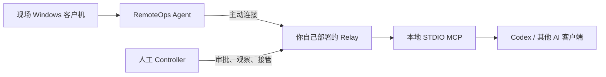

# RemoteOps

[English README](README.en.md)

RemoteOps 是一个让 AI 参与远程运维的开源工具。它保留传统远程终端的连接和权限边界，但把工程师手动输入命令、读取结果、整理信息的部分交给 AI 协助完成。

过去，工程师需要亲自连接现场电脑、逐条执行命令并判断结果；现在可以在本机让 AI 读取现场环境、执行受控命令、分析输出，并在需要时由人审批或接管。现场电脑只需运行 RemoteOps Agent，不需要安装 AI 客户端、配置 SSH 或开放公网入站端口。

当前预览以 Windows 控制台、文件、系统、串口和 SSH 诊断为主，暂不包含屏幕采集、鼠标键盘控制等图形化操作。未来计划通过独立 Visual Provider 接入图形能力，让 AI 结合控制台和图形界面协同诊断；这不等同于把 RemoteOps 做成传统远程桌面或通用网络隧道。

## 工作方式

简单理解：现场运行一个 Agent，工程师在本机运行 MCP，两端通过你自己部署的 Relay 连接，让 Codex 或其他 AI 客户端调用远程诊断工具。Relay 就是这条连接的中转服务。



- **Agent（现场端程序）**：运行在现场 Windows 电脑上。它会主动把连接发到 Relay，所以现场不需要开放公网端口；同时显示配对码、报告脱敏环境信息，并按现场权限执行操作。
- **Relay（中转服务）**：由组织或部署者运行在 Linux Docker 中，负责把现场电脑和工程师本机连接起来，并处理身份、会话和审批状态。本项目不提供共享公共 Relay。
- **MCP（AI 工具接口）**：运行在工程师本机，让 Codex 或其他 AI 客户端能够调用 RemoteOps 的远程诊断工具。
- **控制方式**：配对后 MCP 默认逐项确认，修改操作由当前用户在 MCP 中确认；用户也可以按单个 Agent 开启完全控制，空闲一小时自动恢复逐项确认。独立 Human Controller 保留给后续人工接管和多人协作。

## 当前状态

当前源码版本为 `0.2.0-preview.1`，这是准备中的首个 GitHub Technical Preview 候选。当前源码适合开发者和试点验证，不建议直接用于关键生产环境；GitHub Release 产物仍需完成独立构建和发布门禁。

- 协议版本：`v12`
- 当前现场端：Windows x64 Agent
- 首版 Relay 部署：Linux x64 + Docker
- Codex 控制端：Windows x64、Apple Silicon macOS
- 后续兼容方向：Linux/macOS Agent 和更多 Relay 宿主平台
- AI 入口：本地 STDIO MCP（Model Context Protocol）
- 许可证：[AGPL-3.0-only](LICENSE)

已完成核心链路、权限模型、环境画像、MCP 工具、双语 GUI 和串口本地回归。以下事项仍待公开发布前或试点中验证：低权限 Windows、Windows Service、真实串口/交换机硬件、代码签名，以及 `0.2.0-preview.1` Agent GUI 和静默 MCP 调用在 Windows Server、RDP、云主机及虚拟机中的兼容性复测。

## 它适合解决的问题

- **现场电脑无法被外部直接连接**：电脑位于客户内网、NAT 或防火墙后，无法直接 SSH/RDP 连接，或者客户不允许开放入站端口。
- **客户机器不方便安装 AI 工具**：现场只运行 RemoteOps Agent，Codex 或其他 AI 客户端留在工程师本机。
- **工程师需要反复执行命令和分析输出**：AI 可以通过 PowerShell、CMD、日志和设备控制台读取环境、执行受控命令、对比结果并整理诊断线索。
- **需要处理 Windows 和现场设备故障**：查看进程、服务、网络、驱动和系统信息，并在授权范围内访问串口或 SSH 设备。
- **敏感操作需要人确认**：AI 可以提出重启、服务控制或配置修改请求，由人工审批后执行；低风险诊断则可以自动连续进行。

当前版本优先使用控制台和结构化工具，因为命令输出、日志和错误码更适合 AI 读取、比对、复现和审计。未来如果需要让 AI 操作只能通过桌面软件完成的任务，再接入图形化能力。

## 能力概览

- Windows Agent CLI、GUI，以及仍在验收中的 Windows Service
- Linux Docker Relay，Agent 仅主动出站连接
- Windows Controller CLI/GUI，以及 Windows x64、Apple Silicon macOS 的 Codex STDIO MCP
- CMD、Windows PowerShell、PowerShell 7、OpenSSH 能力发现
- 结构化 Shell、文件、进程、服务、重启、指定 TCP、SSH 和串口操作
- CLI/MCP 文件传输使用 1 MiB 分块，单文件上限 16 GiB；超过 1 GiB 时必须由当前用户单独确认，上传和下载覆盖均使用同目录临时文件、SHA-256 校验和可恢复原子提交
- 一次性及持久 CMD、Windows PowerShell、PowerShell 7 子进程在 Windows 上隐藏运行；持久 Shell 可显式 `close_shell`，执行 `exit` 后也会正确清理句柄
- `ReadOnly`、`ApprovalRequired`、`ControllerApproved`、`FullAccess` 四种底层权限语义；普通 MCP 使用 `ControllerApproved`，Agent 本地仍执行最终安全校验
- Human 与 AI 可在同一会话中协作，不同 Owner 不能混入同一会话
- TLS 系统可信根、显式 CA PEM 和人工核对证书指纹三种信任路径
- 中文/英文 GUI、结构化错误、超时、取消、事件流和脱敏审计

串口和交换机能力已经完成核心实现与本地回归，真实硬件上的正式远程路径仍需现场验收。Relay 断线后的恢复仅在 Agent 状态/恢复令牌有效且同一 MCP 进程仍在运行时成立；未完成请求、审批和在途写操作不会自动重放，重启 MCP/Codex 后需要重新配对。

## 明确边界

当前预览不包含：

- 屏幕采集、画面编码、鼠标键盘远程控制和多显示器
- WebRTC、RDP/VNC 网关、SOCKS、任意端口转发、反向隧道和网段扫描
- macOS/Linux 被控端
- 共享公共 Relay、代理池或多租户 SaaS 控制面
- 无人值守的通用远控、堡垒机、终端防护或资产管理能力

RemoteOps 的长期方向是让 AI 在控制台和图形界面之间协同工作：优先使用结构化的命令、日志和设备输出，在必要时调用图形能力完成只能通过桌面软件进行的操作。具体权限、审批和人工接管边界由部署策略决定。图形能力将优先通过独立 Visual Provider 或现有图形 MCP 接入，不在核心项目中重复实现视频编码、远程桌面协议和 UI 自动化引擎；方案调研见 [docs/VISUAL_PROVIDER_RESEARCH.md](docs/VISUAL_PROVIDER_RESEARCH.md)。

## 快速开始

如果 AI 能操作准备部署 Relay 的 Linux 主机，可以把下面的指令发给它；如果不能，直接跳到手工部署。

### 1. 让 AI 协助部署 Relay

如果当前 AI 客户端已经获得本机终端权限，可以把下面的指令交给它。使用前先在 RemoteOps GitHub 仓库页面打开本 README，或把页面的真实仓库地址一并提供给 AI；本文不硬编码尚未确认的发布地址。AI 没有终端权限时，应只生成命令，不要假设自己已经完成部署。

```text
请阅读当前 RemoteOps GitHub 仓库的 README.md 以及其中链接的 Relay 部署说明，帮我在当前 Linux 主机上部署 RemoteOps Relay。先检查系统、Docker、端口、DNS 和 TLS 条件，给出部署计划并等待我确认；确认后再完成配置、启动和健康检查。需要 Token、Owner UUID 或证书时让我通过安全方式提供，不要把凭据写入聊天、日志或 Git，也不要覆盖已有配置或执行全局 Docker 清理。
```

### 2. 手工部署

#### 2.1 部署 Relay

首版 Relay 部署支持 Linux x64 + Docker。Windows 宿主机可以尝试通过 Docker Desktop 或 WSL2 运行 Linux 容器，但当前没有作为独立平台完成验收。

正式部署前需要准备：

- Linux x64 主机、Docker Engine 和 Docker Compose 插件；
- 一个 Agent 和工程师本机都能访问的域名或 IP；
- 对外可访问的 TCP `7443`，健康检查端口 `18080` 默认只绑定本机回环地址；
- 包含实际域名或 IP 的 TLS SAN。首次实验可以使用 Relay 自动生成的自签名证书，正式部署应使用受信任证书或按安全文档配置私有 CA。

进入仓库根目录后，先复制部署模板：

```bash
cp deploy/relay/.env.example deploy/relay/.env
```

编辑 `deploy/relay/.env`，至少设置以下值：

```dotenv
REMOTEOPS_TLS_SANS=relay.example.com,remoteops-relay,localhost,127.0.0.1
REMOTEOPS_RELAY_PORT=7443
REMOTEOPS_HEALTH_PORT=18080
REMOTEOPS_HUMAN_CONTROLLER_TOKEN=<至少 32 字节的随机值>
REMOTEOPS_AI_CONTROLLER_TOKEN=<另一组至少 32 字节的随机值>
REMOTEOPS_CONTROLLER_OWNER_ID=<非全零 UUID>
```

两个 Controller Token 必须互不相同，Human 和 AI 必须使用同一个 Owner UUID。Token、私钥和真实 Owner 不得提交到 Git。然后检查 Compose 配置并启动 Relay：

```bash
chmod 600 deploy/relay/.env
docker compose --env-file deploy/relay/.env -f deploy/relay/docker-compose.yml config --quiet
docker compose --env-file deploy/relay/.env -f deploy/relay/docker-compose.yml up -d --build
```

检查容器和健康状态：

```bash
docker compose --env-file deploy/relay/.env -f deploy/relay/docker-compose.yml ps
curl --fail http://127.0.0.1:18080/health
docker compose --env-file deploy/relay/.env -f deploy/relay/docker-compose.yml logs --tail 100
```

完成 Relay 后，再继续启动 Agent 和安装本机 MCP。完整的部署边界、证书说明、备份和故障排查见 [docs/Relay部署说明.md](docs/Relay部署说明.md)；实验室三机验收仍见 [docs/部署与三机验收手册.md](docs/部署与三机验收手册.md)。

#### 2.2 启动现场 Agent

从 Windows x64 发布包中解压并运行 `remoteops-agent-gui.exe`。首次启动只需填写 Relay 地址，不需要入网码或部署级 Agent Token。公网 CA 默认使用 Windows 系统可信根，不需要证书文件；未知自签名证书会在发送 RemoteOps 凭据前显示 SHA-256 指纹，现场用户通过独立可信渠道核对后可以仅本次继续或信任并保存。私有 CA、CLI 和 Service 等无交互部署仍可预置 `ca_cert` 或已核对的 `tls_fingerprint`。

Agent 窗口会显示连接状态、临时控制码、本机能力和当前协助权限。控制码只用于配对，不要写入文档、日志、截图或配置仓库。`remoteops-agent.exe` 供命令行自动化和故障排查使用。

#### 2.3 安装本机 MCP

Windows x64 解压 `RemoteOps-MCP-Windows-x64-0.2.0-preview.1.zip`，在解压目录运行：

```powershell
powershell.exe -NoProfile -ExecutionPolicy Bypass -File .\Install-RemoteOpsMcp.ps1 `
  -RelayAddress 'relay.example.com:7443' `
  -OwnerId '<controller-owner-uuid>'
```

安装脚本会隐藏提示输入 AI Controller Token，并将 Token 和 Owner 保存为当前 Windows 用户环境变量。私有 CA 或证书指纹分别使用 `-CaCert` 或 `-TlsFingerprint`，两者只能选择一种。安装完成后完全退出并重新打开 Codex，确认 `/mcp` 中存在并已连接 `remoteops`。

Apple Silicon Mac 解压 `RemoteOps-MCP-macOS-arm64-0.2.0-preview.1.tar.gz`，进入解压目录运行：

```bash
chmod +x install-remoteops-mcp.sh test-remoteops-mcp.sh uninstall-remoteops-mcp.sh
./install-remoteops-mcp.sh \
  --relay relay.example.com:7443 \
  --owner-id '<controller-owner-uuid>'
```

macOS 安装器会把 Token 保存到当前用户的 Keychain，通过本地启动脚本安全传给 MCP；Token 不写入 Codex 配置或 RemoteOps JSON。首发 Mac 包只支持 Apple Silicon，Intel Mac、代码签名和 Apple Notarization 尚未完成。详细步骤见 [macOS MCP 接入说明](docs/macOSMCP接入说明.md)。

#### 2.4 先做只读验证

```text
使用 RemoteOps 配对现场客户机，控制码是 Agent 窗口当前显示的控制码。
```

```text
使用 RemoteOps 列出远程连接，并查看现场客户机的 IPv4 地址、默认网关和 DNS，只执行只读命令。
```

后续操作必须使用 `list_connections` 返回的准确 `session_id`，不能根据主机名或别名猜测目标。涉及写入、重启、服务控制或串口写入时，先启动 Human Controller 并完成精确审批；MCP 不能批准自己的高风险操作。

如果当前尚未有 GitHub Release，请先按下方构建命令从源码生成发布包；正式发布前不要把本地 `artifacts` 当作公开下载源。

## 构建与验证

要求 Rust 工具链满足根 `Cargo.toml` 中声明的 `rust-version`，并准备 Docker、PowerShell 和 Windows x64 构建环境。

```powershell
cargo fmt --all -- --check
cargo check --workspace --locked
cargo clippy --workspace --all-targets --locked -- -D warnings
cargo test --workspace --locked
.\scripts\Test-Documentation.ps1
```

构建发布包：

```powershell
.\scripts\Build-Release.ps1
```

GitHub Release 包含 Windows Agent/Controller、Windows MCP、Apple Silicon macOS MCP、Linux x64 Relay、项目与第三方许可证/依赖清单和 `SHA256SUMS.txt`。正式创建 Release 前，应在干净提交或 CI 中重新构建并复核哈希。Windows 产物当前未进行 Authenticode 签名，macOS MCP 当前也未进行 Developer ID 签名和 Notarization。

## 安全要点

- Agent 只主动出站连接 Relay，不监听客户公网端口。
- Agent 负责执行能力、路径、会话和结构化操作校验，不在现场界面判断自然语言意图或切换控制模式。
- 普通 MCP 默认逐项确认；用户可以仅为当前 `session_id` 临时开启完全控制，授权空闲一小时后失效。
- 所有目标操作绑定不可变 `session_id`，不能根据主机名或别名猜测目标。
- Token、Owner UUID、控制码、恢复令牌、证书私钥和客户信息不得写入源码、文档、日志或安装包。

完整安全边界和漏洞报告方式见 [SECURITY.md](SECURITY.md) 与 [docs/安全模型.md](docs/安全模型.md)。

## 文档

- [docs/PROJECT_STATUS.md](docs/PROJECT_STATUS.md)：公开开发进度和发布门禁
- [docs/ROADMAP.md](docs/ROADMAP.md)：当前阶段、未来规划和停止条件
- [docs/README.md](docs/README.md)：使用、部署、安全和维护文档索引
- [docs/RemoteOpsMCP使用手册.md](docs/RemoteOpsMCP使用手册.md)：Codex MCP 接入与故障排查
- [docs/macOSMCP接入说明.md](docs/macOSMCP接入说明.md)：Apple Silicon Mac 安装、验证和卸载
- [docs/部署与三机验收手册.md](docs/部署与三机验收手册.md)：Relay、Agent 和三机验收
- [CONTRIBUTING.md](CONTRIBUTING.md)：贡献方式
- [SECURITY.md](SECURITY.md)：安全边界与漏洞报告

## 许可证

RemoteOps 使用 [AGPL-3.0-only](LICENSE)。项目保持自托管和供应商中立，不要求使用特定 AI 服务；集成第三方 Visual Provider 前，请单独核对其许可证和商用限制。
